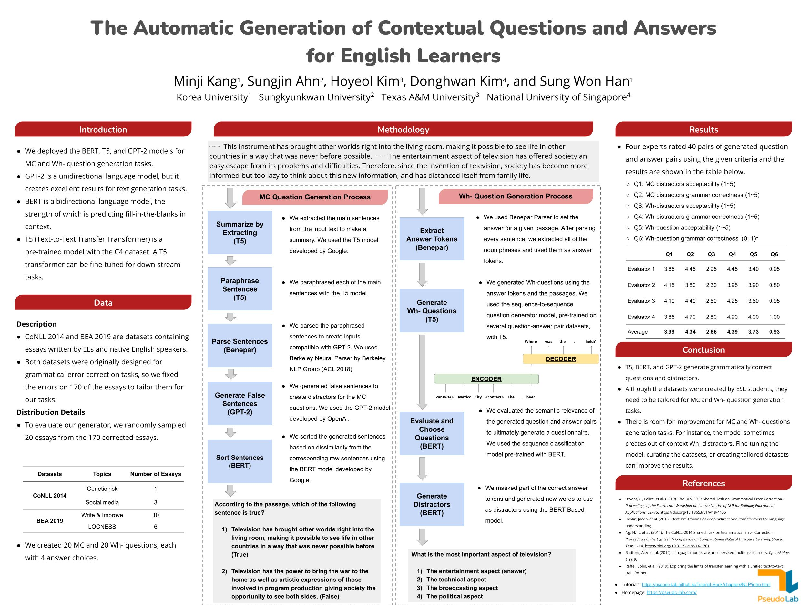

# **The Automatic Generation of Contextual Questions and Answers for English Learners**

## **Abstract**

Understanding context is essential for ESL (English as a Second Language) students to become  skilled in English. While there is an abundance of extant contextual questions, they are not tailored to ESL teachers’ course objectives and reading materials. For this reason, ESL teachers must continuously create their own contextual questions. The NLP question and answer generation tasks can lift ESL teachers’ workload by creating MCQs (Multiple Choice Questions), T/F (True or False) questions, and fill-in-the-blank questions, along with answers. We deployed a model which automatically generates MC and Wh- questions with answers. We display several examples and explain the process for generating MC and Wh- questions and answers. For our research methods, we first performed text preprocessing with the CoNLL-2014 and BEA-2019 datasets, which consist of essays written by native and non-native English students. After that, we deployed GPT-2, BERT, and T5 in order to complete the question and answer generation task. The contextual question and answer generation model will contribute specifically to ESL teachers who manually create MC and Wh- questions for ESL students, as well as to the fields of education, digital humanities, and computer science. In addition, we share tutorials for this task with the public so that anyone can make use of our research.

## **Poster**

## **Tutorial**

* https://pseudo-lab.github.io/Tutorial-Book/chapters/NLP/intro.html

## **Contributors**

* [Minji Kang](https://www.linkedin.com/in/mmminji/), Korea University
* [Sungjin Ahn](https://www.linkedin.com/in/sungjin-ahn/), Sungkyunkwan University
* [Hoyeol Kim](https://github.com/elibooklover), Texas A&M University
* [Donghwan Kim](https://www.linkedin.com/in/da-devangelist/), National University of Singapore
* Sung Won Han, Korea University

## **References**

1. Bryant, C., Felice, et al. (2019). The BEA-2019 Shared Task on Grammatical Error Correction. Proceedings of the Fourteenth Workshop on Innovative Use of NLP for Building Educational Applications, 52–75. https://doi.org/10.18653/v1/w19-4406
2. Devlin, Jacob, et al. (2018). Bert: Pre-training of deep bidirectional transformers for language understanding.
3. Ng, H. T., et al. (2014). The CoNLL-2014 Shared Task on Grammatical Error Correction. Proceedings of the Eighteenth Conference on Computational Natural Language Learning: Shared Task, 1–14. https://doi.org/10.3115/v1/W14-1701
4. Radford, Alec, et al. (2019). Language models are unsupervised multitask learners. OpenAI blog, 1(8), 9.
5. Raffel, Colin, et al. (2019). Exploring the limits of transfer learning with a unified text-to-text transformer.